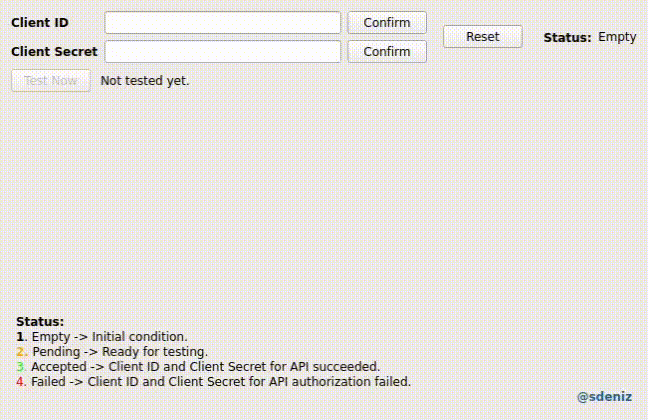
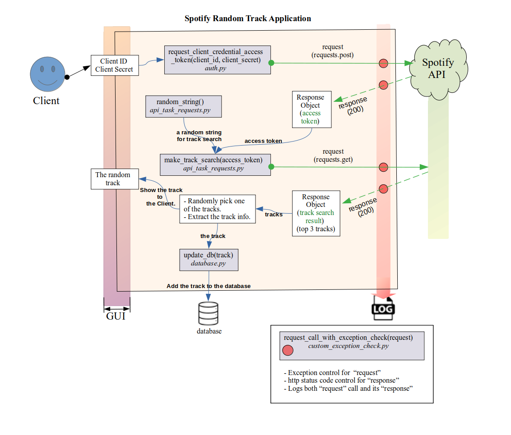

# Spotify API - Random Track Project
A project for discovering random tracks via Spotify API.

### **Project motivation** 
Recommendation systems try to find contents that a person might like. This structure mostly results in a system where similar results are suggested. To discover new tracks I wanted to randomize the track search. And thanks to randomize track request I have come across with new composers. Here is an example: https://www.youtube.com/watch?v=tFIIMa0hKNI.

**Update:** `/src` modules **refactored** with SOLID in mind. The Graphical User Interface is built with PyQt5 for this Spotify API Random Track Project.

#### Simple Application Flow
- The application requires `Client ID` and `Client Secret` which can be obtained from Spotify Developer Dashboard.
- The application makes "post" request to Spotify API service in order to obtain `client credential access token`.
- The application produce `random string` for track search.
- The application makes a "get" request for track search to Spotify API service in order to obtain top 3 `track search result`.
- The application randomly pick one of the tracks and shows `the track` and its information to the Client.
----
Graphical User Interface (**GUI**) which is built with **PyQt5**.

**A demonstration:** 



---

**To run the GUI, preferably in virtual environment:**

Command -> ```pip install -r /path_to/requirements.txt```\
Command -> ```python3 API-GUI.py```  

[*Requirements:*](https://github.com/rootloginson/Qt-GUI-Implementations/blob/master/requirements.txt)  
PyQt5==5.15.6  
requests==2.26.0  

To obtain **Client ID** and **Client Secret**: \
Log in to -> https://developer.spotify.com/dashboard/ with a spotify account. They can be found in the *Dashboard* tab.

---

### Simple Application Flow Diagram


---

**Interpreting the Logs**

Log file contains:

- function running time: gmt +0
- levelname = "INFO"
- name: The name of the logger used to log the event represented by this LogRecord ([doc. ref.](https://docs.python.org/3/library/logging.html)). 
- request status : "SUCCESS", "ERROR" or "FAILED"
- status_code, eg. 200, 201, 400 etc.
- the name of the method/function (foo.__ qualname __) from which it was called.

[Log file example of test cases](https://github.com/rootloginson/Qt-GUI-Implementations/blob/master/spotify_app.log)

---
**Interpreting the SQL Table**
```sql
CREATE TABLE IF NOT EXISTS Random_Tracks(
            id INTEGER NOT NULL PRIMARY KEY AUTOINCREMENT UNIQUE,
            date_time TEXT,
            artist_name TEXT,
            album_name TEXT,
            track_name TEXT,
            track_external_url TEXT,
)
```
[SQL Database Output Image](markdown_files/sql_db_ss.jpg)  

The database update module: [database.py](https://github.com/rootloginson/Qt-GUI-Implementations/blob/master/src/database.py)

---

### **Time Savers for Developers:**

For GET and POST requests, some endpoints and parameters are passed as arguments and keyword arguments. Some of them are passed as encoded url.

**A brief example of Spotify API use case**

In order to add tracks to a playlist 2 API request is necessary. And these requests requires [authorization](https://developer.spotify.com/documentation/general/guides/authorization-guide/) requests.

  1. API request for [**search**](https://developer.spotify.com/documentation/web-api/reference/#/operations/search)
  
      - Access Token for Spotify search can be obtain with [Client Credentials Flow](https://developer.spotify.com/documentation/general/guides/authorization/client-credentials/). For this authorization type ***client_id*** and ***client_secret*** is required which can be obtained from developer dashboard. This type of authorization does not require user confirmation of the application.
      
      
  2. API request for [**adding item to playlist**](https://developer.spotify.com/documentation/web-api/reference/#/operations/add-tracks-to-playlist)
      - Access Token for Spotify search can be obtain with [Authorization Code Flow](https://developer.spotify.com/documentation/general/guides/authorization/code-flow/). For this authorization type ***client_id***, ***client_secret*** and ***refresh token*** is required. Refresh Token is permanently valid unless authorization is deleted by the user. In a nutshell:
      
          - Request a url. Click the url.
          - Give authorization access to application with the user account.
          - Get the redirected url and extract the **'code'** value from the url.
          - Request a refresh token with this code.
          - Use this refresh token to get 'access_token'.
          
(*! All the access tokens expires in 3600 seconds.*)


<p>&nbsp;</p>
